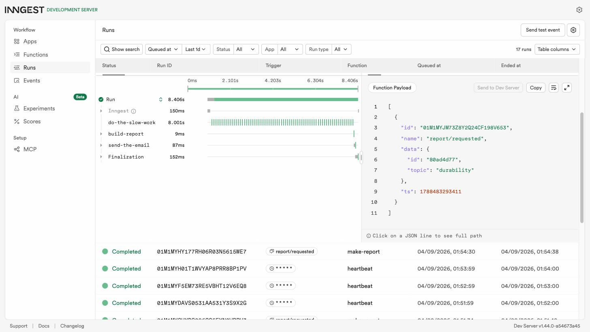

# Report API — background jobs with FastAPI + Inngest

A small API with one slow task. `POST /reports` answers in milliseconds with `202 Accepted`;
the ~8 second work happens in a background job. A status endpoint reports progress, and a
cron job runs on the clock with no request at all.

FlyRank Internship · Backend Track · W4 · A7 — Python lane.

## Run it

Two terminals, one command each.

```bash
# Terminal 1 — the API (http://localhost:8000)
python3 -m venv .venv && .venv/bin/pip install -r requirements.txt
.venv/bin/uvicorn app.main:app --port 8000

# Terminal 2 — the Inngest Dev Server (dashboard at http://localhost:8288)
npx inngest-cli@latest dev -u http://localhost:8000/api/inngest
```

Requires Python 3.10+ and Node.js (only to run the Inngest CLI). No account, no credit card.

## Endpoints

| Method | Path | Behaviour |
| --- | --- | --- |
| `GET` | `/health` | `{"status": "ok"}` |
| `POST` | `/reports` | Body `{"topic": "cats"}` → `202` + `{"id", "status": "pending"}`. Missing/blank topic → `400`, no event sent. |
| `GET` | `/reports` | Every report and its status — the control panel. |
| `GET` | `/reports/{id}` | The saved report: `pending` first, then `done` + `result`. Unknown id → `404`. |
| `POST`/`PUT` | `/api/inngest` | Where the Dev Server finds and runs the functions. |

## Background functions

| Function | Trigger | What it does |
| --- | --- | --- |
| `say-hello` | event `test/hello` | Sleeps 5s, returns a greeting. The "is it wired up" function. |
| `make-report` | event `report/requested` | Four steps: `step.sleep("do-the-slow-work", 8s)` → `step.run("build-report", ...)` saves the result as `done` → `step.run("send-the-email", ...)` writes `outbox/<id>.txt`. `retries=2`; topic `"fail"` raises, and an `on_failure` handler marks the report `failed`. |
| `heartbeat` | cron `* * * * *` | Logs one line: how many reports are pending, done, failed. |
| `cleanup` | cron `*/5 * * * *` | Every 5 minutes, deletes `done` reports older than 10 minutes. Cron's most common real job is taking out the trash. |

## Proof: 202 now, result later

```
$ time curl -i -s -X POST http://localhost:8000/reports \
    -H "Content-Type: application/json" -d '{"topic":"cats"}'
HTTP/1.1 202 Accepted
date: Fri, 04 Sep 2026 00:51:33 GMT
server: uvicorn
content-length: 36
content-type: application/json

{"id":"545c5c27","status":"pending"}

real    0m0.056s

$ curl -s http://localhost:8000/reports/545c5c27          # immediately
{"id":"545c5c27","topic":"cats","status":"pending"}

$ curl -s http://localhost:8000/reports/545c5c27          # ~10 seconds later
{"id":"545c5c27","topic":"cats","status":"done","result":"Report on cats: 3 findings, 2 recommendations."}
```

56 milliseconds for work that takes 8 seconds.

## Stage 3 — retry vs. reject

A retry is for a **wrong moment**; a `400` is for a **wrong input**. A dropped connection or a
hiccuping service will probably succeed on the next attempt, so the job tool runs it again with
backoff. A request with no topic will fail identically every time, so retrying it only wastes
attempts — reject it at the door and never create the job.

## Stage 4 — reading a cron expression

The five fields are `minute · hour · day-of-month · month · day-of-week`.

- Every day at 08:00 → `0 8 * * *`
- Every Sunday at 22:00 → `0 22 * * 0`

The heartbeat here uses `* * * * *` (every minute) so the checkpoint is quick to see; a real
one would run daily. Servers usually run cron in UTC — check the timezone before trusting a
schedule.

## Dashboard

All three functions, including the failed run and the cron heartbeats:


The `"fail"` topic, retried three times with growing backoff before the run ends `Failed`:


> The screenshots were taken with the Dev Server on port 8299 because 8288 was in use on that
> machine; the default `npx inngest-cli@latest dev` command uses 8288.

## Extras

- **`GET /reports`** — the whole map at once.
- **The "email"** — `make-report` also writes `outbox/<id>.txt`, a stand-in for sending mail
  from a job, which is where this pattern lives in real products.
- **A cleanup cron** — `*/5 * * * *` means every 5 minutes; it deletes `done` reports older
  than 10 minutes.
- **The restart experiment** — see below.

## Stretch: idempotency

Send the same `report/requested` event twice and the report is built only **once**. The first
step checks whether that id is already `done` and, if so, returns the saved result and stops:

```
$ curl -X POST http://localhost:8288/e/dev_key -H "Content-Type: application/json"     -d '{"name":"report/requested","data":{"id":"73c28fb1","topic":"idem2"}}'

duplicate run: Completed | started 00:58:05.439Z | ended 00:58:05.687Z
output: {"id": "73c28fb1", "result": "Report on idem2: 3 findings, 2 recommendations."}
outbox mtime before=1788483471 after=1788483471   # unchanged
```

248 milliseconds instead of 8 seconds, and no second outbox file.

The check lives inside a `step.run`, not in plain function-body code. A step function is
re-entered from the top on every step, so a bare `if already done: return` would fire on the
function's *own* replay and skip the remaining steps. Wrapping it in a step memoizes the
answer from the first invocation.

**Why jobs must survive running twice:** a queue can only promise *at-least-once* delivery — a
network blip between "work finished" and "acknowledged" means the same event gets redelivered.
The job tool cannot make that impossible, so the job has to make it harmless.

## Stretch: concurrency limit

`concurrency=[inngest.Concurrency(limit=2)]` caps `make-report` at two runs at once.

Enqueue five and, with the assignment's `step.sleep`, all five still finish together — a run
that is *sleeping* is not running, so it releases its slot. Swapping the sleep for eight
seconds of blocking work inside a `step.run` makes the limit visible immediately: the five
reports finished in three waves of 2, 2, 1, nine seconds apart.

```
q2 done 01:59:23    q3 done 01:59:24     # wave 1
q1 done 01:59:32    q5 done 01:59:32     # wave 2
q4 done 01:59:41                         # wave 3
```

**When would you want a queue to be slow?** When the thing on the other end is fragile or
metered — a third-party API with a rate limit, a database that falls over past N connections,
or a paid model endpoint. A queue that refuses to go faster turns a burst that would take the
dependency down into a line that merely takes longer.

## The restart experiment — durability

Start a report, then kill the API (`Ctrl-C`) while the job is inside its 8-second sleep, and
start it again three seconds later.

The job did not care. Inngest, not the API process, owns the run: it had already recorded that
`do-the-slow-work` was sleeping, so when the sleep expired it called the freshly restarted
server to run the remaining steps. `build-report` and `send-the-email` executed once, the
outbox file was written, and the run ended `Completed` — 8.406s end to end, as if nothing had
happened. Steps that finish are never re-run; only the unfinished remainder is resumed. That
property is called being **durable**, and it is why a crashed server does not mean a lost job.



## AI vs me

I built Stages 0–5 by hand first, then asked an AI to build the same system from a prompt I
wrote from memory. Its code is quarantined in [`ai-version/`](ai-version/); the prompts are in
[`ai-version/PROMPT.md`](ai-version/PROMPT.md). I ran my own Stage 2 and Stage 3 checkpoints
against it.

**Stage 2 passed.** `POST /reports` answered `202` in 39 ms and the poll flipped to `done`
about ten seconds later. The core pattern was right on the first try.

**Stage 3 failed, three ways.**

| Check | Mine | AI v1 |
| --- | --- | --- |
| `POST /reports` with `{}` | `400` | **`422`** |
| `POST /reports` with `{"topic":"   "}` | `400`, no job | **`202`, job created** |
| A report whose job ran out of retries | `failed` | **`pending`, forever** |

1. **`422`, not `400`.** The AI declared `topic: str` as a required Pydantic field, so FastAPI's
   own validation rejects the request *before* the handler runs and its `raise
   HTTPException(400)` is dead code. The checkpoint asks for `400` specifically. I understand
   why it happened — `topic: str` is the obvious way to say "required" — but it is wrong here,
   and it is the kind of wrong that a passing-looking handler hides.
2. **A blank topic is accepted.** `if not request.topic` is false for `"   "`, so a whitespace
   topic gets a `202` and a real background job. No trimming anywhere.
3. **The `failed` count can never be non-zero.** The AI wrote the cron to count `pending`,
   `done` and `failed` — because my prompt asked for those three words — but nothing in its
   code ever writes `failed`. There is no `on_failure` handler, so when the run exhausts its
   retries the dashboard says `Failed` and the API never finds out. I watched its heartbeat
   print `Reports: 5 pending, 1 done, 0 failed` while the dashboard showed two `Failed` runs of
   the same function. A counter that is structurally always zero is worse than no counter.

**What the AI did better.** Its heartbeat is three plain list comprehensions where mine is an
accumulator loop; the comprehensions are easier to read at a glance and I would take them. And
keeping everything in one file is genuinely closer to the spirit of an under-120-line
assignment than my four-module split — a stranger reads it top to bottom in one sitting. Both
are things I understand and could defend; neither is a correctness win.

**What my prompt forgot to specify — and what the AI silently decided for me.** I never said
which status code a *missing* field should produce, so it inherited FastAPI's. I never said a
report has to be able to *reach* the failed state, only that something should count them. I
never named the app id, the serve path, or the port, so it invented `ai-report-api` and I had
to register it by hand before any job would run. I never mentioned idempotency or a
concurrency limit, so it has neither. The pattern is consistent: **everything I did not say,
it decided — and the decisions it made silently were exactly the ones I had spent the previous
five stages learning were load-bearing.**

**The rematch.** Prompt v2 adds three sentences: blank-or-missing topic must return exactly
`400`; a report must actually reach `failed` when retries run out; and the app id, serve path
and port are named. `main_v2.py` fixes all three — `400` for both bad inputs, an `on_failure`
handler that flips the report to `failed` (I watched it flip after the third attempt), and
`ctx.logger` instead of the root logger so the heartbeat line is attached to its run in the
dashboard. Nineteen lines changed; the difference between a version that fails the checkpoint
and one that passes was three sentences of specification, not a better model.

## Notes

Reports live in an in-memory dict, so they are gone on restart. That is deliberate for this
assignment — the lesson is the job pattern, not persistence.
