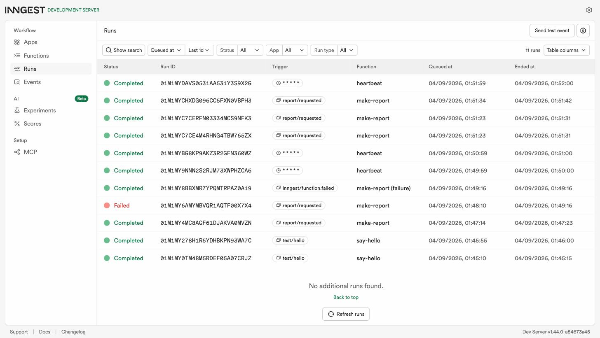
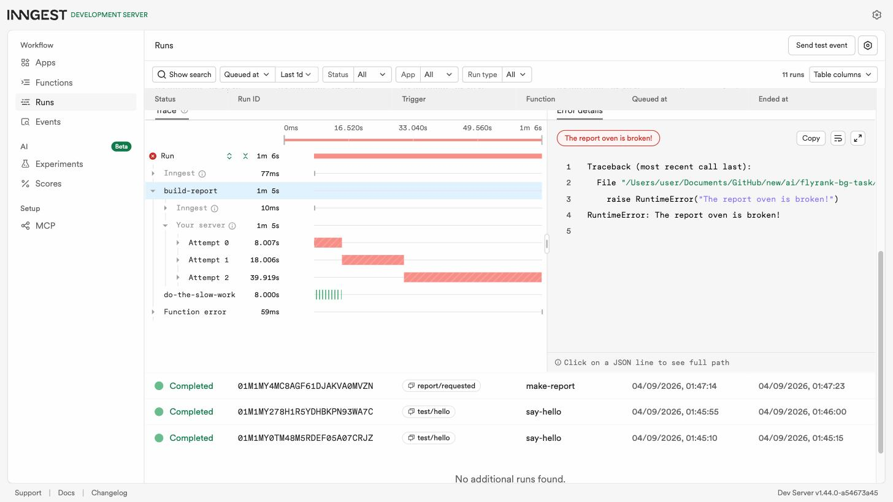

# Report API — background jobs with FastAPI + Inngest

A small API with one slow task. `POST /reports` answers in milliseconds with `202 Accepted`;
the ~8 second work happens in a background job. A status endpoint reports progress, and a
cron job runs on the clock with no request at all.

FlyRank Internship · Backend Track · W4 · A7 — Python lane.

## Run it

Two terminals, one command each.

```bash
# Terminal 1 — the API (http://localhost:8000)
python3 -m venv .venv && .venv/bin/pip install -r requirements.txt
.venv/bin/uvicorn app.main:app --port 8000

# Terminal 2 — the Inngest Dev Server (dashboard at http://localhost:8288)
npx inngest-cli@latest dev -u http://localhost:8000/api/inngest
```

Requires Python 3.10+ and Node.js (only to run the Inngest CLI). No account, no credit card.

## Endpoints

| Method | Path | Behaviour |
| --- | --- | --- |
| `GET` | `/health` | `{"status": "ok"}` |
| `POST` | `/reports` | Body `{"topic": "cats"}` → `202` + `{"id", "status": "pending"}`. Missing/blank topic → `400`, no event sent. |
| `GET` | `/reports/{id}` | The saved report: `pending` first, then `done` + `result`. Unknown id → `404`. |
| `POST`/`PUT` | `/api/inngest` | Where the Dev Server finds and runs the functions. |

## Background functions

| Function | Trigger | What it does |
| --- | --- | --- |
| `say-hello` | event `test/hello` | Sleeps 5s, returns a greeting. The "is it wired up" function. |
| `make-report` | event `report/requested` | `step.sleep("do-the-slow-work", 8s)` → `step.run("build-report", ...)` saves the result as `done`. `retries=2`; topic `"fail"` raises, and an `on_failure` handler marks the report `failed`. |
| `heartbeat` | cron `* * * * *` | Logs one line: how many reports are pending, done, failed. |

## Proof: 202 now, result later

```
$ time curl -i -s -X POST http://localhost:8000/reports \
    -H "Content-Type: application/json" -d '{"topic":"cats"}'
HTTP/1.1 202 Accepted
date: Fri, 04 Sep 2026 00:51:33 GMT
server: uvicorn
content-length: 36
content-type: application/json

{"id":"545c5c27","status":"pending"}

real    0m0.056s

$ curl -s http://localhost:8000/reports/545c5c27          # immediately
{"id":"545c5c27","topic":"cats","status":"pending"}

$ curl -s http://localhost:8000/reports/545c5c27          # ~10 seconds later
{"id":"545c5c27","topic":"cats","status":"done","result":"Report on cats: 3 findings, 2 recommendations."}
```

56 milliseconds for work that takes 8 seconds.

## Stage 3 — retry vs. reject

A retry is for a **wrong moment**; a `400` is for a **wrong input**. A dropped connection or a
hiccuping service will probably succeed on the next attempt, so the job tool runs it again with
backoff. A request with no topic will fail identically every time, so retrying it only wastes
attempts — reject it at the door and never create the job.

## Stage 4 — reading a cron expression

The five fields are `minute · hour · day-of-month · month · day-of-week`.

- Every day at 08:00 → `0 8 * * *`
- Every Sunday at 22:00 → `0 22 * * 0`

The heartbeat here uses `* * * * *` (every minute) so the checkpoint is quick to see; a real
one would run daily. Servers usually run cron in UTC — check the timezone before trusting a
schedule.

## Dashboard

All three functions, including the failed run and the cron heartbeats:



The `"fail"` topic, retried three times with growing backoff before the run ends `Failed`:



> The screenshots were taken with the Dev Server on port 8299 because 8288 was in use on that
> machine; the default `npx inngest-cli@latest dev` command uses 8288.

## Notes

Reports live in an in-memory dict, so they are gone on restart. That is deliberate for this
assignment — the lesson is the job pattern, not persistence.
